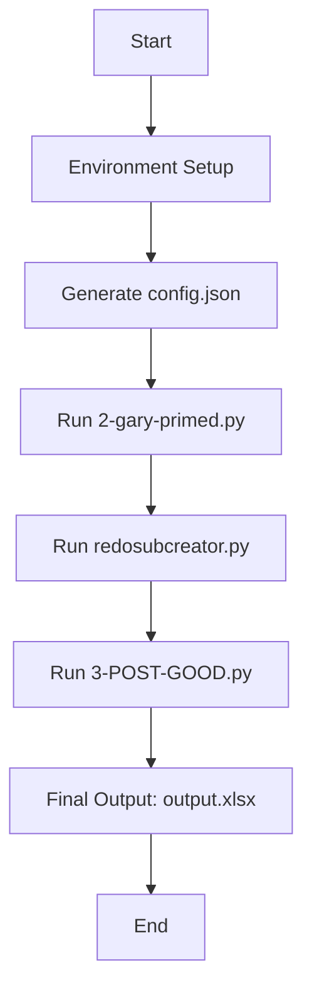

# Congressional Portal Project

## Overview

The **Congressional Portal Project** provides a repository for workflows, methodologies, instructional materials, controlled vocabularies, and more. This repository was created to house large-scale project efficiency methodologies, automated workflows, and to document strategies throughout the project timeline. The project focuses on materials relating to the American Congress from the [Carl Albert Research and Studies Center Archives](https://www.ou.edu/carlalbertcenter/congressional-collection).

Within this repository, we have developed scripts and batch processes designed to automate large-scale archival workflows. The primary goal is to streamline the extraction, analysis, and enrichment of metadata from archival text files using Natural Language Processing (NLP) techniques and OpenAI's GPT models. This automation is crucial for efficiently managing extensive archival collections, ensuring consistent metadata quality, and enabling advanced data analysis.

## Table of Contents

- [Overview](#overview)
- [Importance for Large-Scale Archival Workflows](#importance-for-large-scale-archival-workflows)
- [Workflow Overview](#workflow-overview)
- [Folders](#folders)
- [Tasks Simplified](#tasks-simplified)
- [Content Overview](#content-overview)
- [Steps in the Process](#steps-in-the-process)
  - [1. Environment Setup](#1-environment-setup)
  - [2. Configuration](#2-configuration)
  - [3. Main Pipeline Execution](#3-main-pipeline-execution)
  - [4. Data Extraction and Initial Processing](#4-data-extraction-and-initial-processing)
  - [5. Subject and Creator Assignment](#5-subject-and-creator-assignment)
  - [6. Data Integration and Final Output Generation](#6-data-integration-and-final-output-generation)
- [Getting Started](#getting-started)
  - [Prerequisites](#prerequisites)
  - [Installation](#installation)
  - [Configuration](#configuration)
  - [Execution](#execution)
- [Workflow Diagram](#workflow-diagram)
- [Additional Notes](#additional-notes)
- [Acknowledgements](#acknowledgements)
- [Authors](#authors)
- [License](#license)

## Importance for Large-Scale Archival Workflows

Large-scale archival projects often involve processing thousands of documents, which can be time-consuming and prone to human error if done manually. Automating these workflows:

- **Enhances Efficiency**: Significantly speeds up processing time.
- **Improves Consistency**: Ensures uniform metadata standards across the collection.
- **Enables Scalability**: Allows for handling larger datasets without a proportional increase in resources.
- **Facilitates Advanced Analysis**: Extracted metadata can be used for in-depth research and discovery.

## Workflow Overview

The workflow consists of the following key steps:

1. **Environment Setup**: Install necessary dependencies and set up a virtual environment.
2. **Configuration**: Generate a configuration file (`config.json`) with user-defined paths and API keys.
3. **Data Extraction and Initial Processing**: Process input text files to generate initial metadata.
4. **Subject and Creator Assignment**: Enrich metadata by assigning controlled vocabulary terms.
5. **Data Integration and Final Output Generation**: Merge and format the metadata for archival use.

## Folders

- [**documentation-applications-list**](https://github.com/prys0000/congressional-portal-project/tree/main/documentation-applications-lists): Contains project worksheets, collection indexes, training models, and controlled vocabularies.
- [**workflows**](https://github.com/prys0000/congressional-portal-project/tree/main/workflows): Contains packaged workflows with either executable portable applications or consolidated/compiled scripts for OCR, assigning controlled metadata, and extracting specific text from OCR text.
- [**deprecated-packages**](https://github.com/prys0000/congressional-portal-project/tree/main/deprecated-packages): Contains outdated scripts and notes that have been replaced by newer versions.

## Tasks Simplified

- **Handwritten Documents**: Focus on transcribing hard-to-read text and collecting required metadata quickly and efficiently.
- **Combination of Handwritten and Typewritten Documents**: Developing automated processes to read both handwritten and typewritten documents.
- **Face Recognition**: Bulk processing recognition of faces in images with trained models, scripts, and lists.
- **Transcribing A/V**: Bulk transcription and extraction of audio/visual text to enhance workflow efficiency.
- **Transcribing A/V - Topic Modeling**: Combining bulk transcription of audio/visual materials with advanced topic identification to increase productivity, accuracy, and efficiency.
- **Migration and Finding Aid Transforms**: Bulk processing for creating or updating descriptive metadata and finding aids for archival collections.
- **Quality Control and Error Checking**: Reviewing and verifying the accuracy, completeness, and consistency of digitized and transcribed materials resulting from the above tasks.

## Content Overview

The Center concentrates on content related to **four curated collections, encompassing over 75,677 individual items** from the [**CAC Archives**](https://arc.ou.edu/). Additional digital files are available on our [**Digital Archives Platform**](https://oucac.access.preservica.com/).

| Collection                                                                                                                  | Type              | Topics                                                                                                                                         | Subtopics                                                                                               | Significance                                                                                                                                                                                                                                                                                                                                                                                                                                     | Extent        | Formats                                     |
| --------------------------------------------------------------------------------------------------------------------------- | ----------------- | ---------------------------------------------------------------------------------------------------------------------------------------------- | ------------------------------------------------------------------------------------------------------- | ---------------------------------------------------------------------------------------------------------------------------------------------------------------------------------------------------------------------------------------------------------------------------------------------------------------------------------------------------------------------------------------------------------------------------------------------- | ------------- | ------------------------------------------- |
| Indian Self-Determination                                                                                                   | Topical           | Congress as policy-maker, Leaders and parties, Congress and the courts                                                                         | Types of decisions, Committee leadership, Policy making in committee, Constituent communications, Demography | Congressional offices hold correspondence showcasing intricate strategies used by tribal entities and congressional members. Collections highlight policy actions and issues affecting tribes across various states. While much of the relevant legislation has a national purview, our project isn't solely focused on Oklahoma.                                                                                     | 23 collections | PDF/A, PDF/E, or PDF with original file, TIFF |
| [Robert L. Owen Collection](https://arc.ou.edu/repositories/3/resources/32)                                                 | Collection-Whole  | Congress as policy-maker, Leaders and parties, Congress and the courts                                                                         | Cultural norms                                                                                          | Robert L. Owen was a member of the Cherokee Nation and represented the Five Civilized Tribes as a federal Indian agent before entering politics as a Progressive Democrat. Owen is one of only four Native Americans who have served in the United States Senate.                                                                                                                                                                                    | 199 items     | PDF/A, PDF/E, or PDF with original file, TIFF |
| [U.S. House of Representatives Offices Campaign Ads](https://arc.ou.edu/repositories/3/archival_objects/800009)             | Collection-Whole  | Leaders and parties, Elections, Congress and interest groups, Congress history - general                                                       | Leadership activities, Determinants of voting, Tactics, Electoral outcomes, Impact of technology       | Through the collection of television and radio political advertisements, film, social media, and other sources, the archive seeks to expand the knowledge and understanding of political communications and the growth and changes in this field across the most significant and prolific era in world history.                                                                                                  | 24,678 items  | Motion JPEG 2000, MOV, AVI                   |
| [Carl Albert Photograph Collection](https://arc.ou.edu/repositories/3/archival_objects/422780)                              | Collection-Whole  | Leaders and parties                                                                                                                            | Party leadership files                                                                                 | Exclusive to the Carl Albert Center Archives is the vast personal collection of Albert’s photographs, spanning the entirety of his career.                                                                                                                                                                                                                                                                                                        | 11,000 items  | TIFF                                        |

## Steps in the Process

### 1. Environment Setup

**Script**: `step-1-setup_and_run.bat`

- Checks if Python is installed.
- Removes any existing virtual environment to ensure a clean setup.
- Creates and activates a new virtual environment.
- Upgrades `pip` to the latest version.
- Installs all required Python packages from `requirements.txt`.
- Downloads the `en_core_web_sm` language model for spaCy.
- Runs the main pipeline script (`3pipeline.py`).
- Deactivates the virtual environment after execution.

**Usage**:

Double-click the `step-1-setup_and_run.bat` file or run it from the command line:

```batch
step-1-setup_and_run.bat
```

### 2. Configuration

**Script**: `step-2-run-gary.bat`

- Prompts the user for:
  - Base directory where scripts are located.
  - Input directory containing `.txt` files.
  - Full paths to the main scripts.
- Collects the OpenAI API key securely from the user.
- Dynamically generates a `config.json` file based on user inputs.
- Runs the pipeline script (`3pipeline.py`).

**Usage**:

Run the script and follow the prompts:

```batch
step-2-run-gary.bat
```

### 3. Main Pipeline Execution

**Script**: `3pipeline.py`

- Loads configuration settings from `config.json`.
- Executes the scripts in sequence:
  1. `2-gary-primed.py`
  2. `redosubcreator.py`
  3. `3-POST-GOOD.py`
- Checks for successful completion of each step before proceeding.
- Handles errors and provides informative messages.

**Execution**:

This script is called automatically by the batch files but can be run directly:

```bash
python 3pipeline.py
```

### 4. Data Extraction and Initial Processing

**Script**: `2-gary-primed.py`

- Iterates over the `.txt` files in the input directory.
- Uses OpenAI's GPT model to generate titles and summaries.
- Extracts metadata such as creators, recipients, subjects, dates, named entities, states, tribes, policies, parties, and legal cases.
- Maps dates to congressional sessions.
- Saves the initial metadata to `testtranscript_info.xlsx`.

### 5. Subject and Creator Assignment

**Script**: `redosubcreator.py`

- Loads the initial metadata from `testtranscript_info.xlsx`.
- Uses OpenAI's GPT model to assign relevant creators and subjects based on controlled lists.
- Adds the assigned creators and subjects to the metadata.
- Saves the updated metadata to `updated_excel_file.xlsx`.

### 6. Data Integration and Final Output Generation

**Script**: `3-POST-GOOD.py`

- Loads the initial and updated metadata files.
- Merges assigned creators and subjects into the main DataFrame.
- Preprocesses and standardizes column values.
- Adds static metadata fields required for archival records.
- Reorders columns according to archival standards.
- Saves the final output to `output.xlsx`.

**Usage**:

This script requires three arguments and is called by `3pipeline.py`:

```bash
python 3-POST-GOOD.py <input_file> <updated_excel_file> <output_file>
```

## Getting Started

### Prerequisites

- **Python 3.6 or higher** installed on your system.
- **OpenAI API Key**: Obtain one from [OpenAI](https://platform.openai.com/).

### Installation

1. **Clone the Repository**:

   ```bash
   git clone https://github.com/prys0000/congressional-portal-project.git
   cd congressional-portal-project
   ```

2. **Run the Setup Script**:

   On Windows:

   ```batch
   step-1-setup_and_run.bat
   ```

   This script will handle the environment setup and initiate the pipeline.

### Configuration

- **Input Data**: Place your `.txt` files in the designated input directory.
- **API Key**: You will be prompted to enter your OpenAI API key during the configuration step. Ensure that your API key is kept secure and not hardcoded into any scripts.

### Execution

- Run `step-2-run-gary.bat` to configure and execute the pipeline.
- Follow the prompts provided during execution.

## Workflow Diagram



## Additional Notes

- **Error Handling**: Errors are logged to `errors.log` for troubleshooting.
- **Data Privacy**: Ensure compliance with data protection regulations when handling sensitive data.
- **Customization**:
  - **Controlled Vocabularies**: Controlled vocabularies and mappings can be customized within the scripts to suit specific archival needs.
  - **Static Metadata**: Static metadata fields in `3-POST-GOOD.py` can be adjusted as required.

## Acknowledgements

[Carl Albert Congressional Research and Studies Center Archives](https://www.ou.edu/carlalbertcenter/congressional-collection)

See [acknowledgements](https://github.com/prys0000/congressional-portal-project/blob/main/documentation-applications-lists/acknowledgements.md) for student staff and collaborators.

See [collaborative partners](https://github.com/prys0000/congressional-portal-project/blob/main/collaborative-partners.md) for project partners.

## Authors

[**JA Pryse**](mailto:japryse@ou.edu) - Senior Archivist III

## License

See [LICENSE](https://github.com/prys0000/congressional-portal-project/blob/main/LICENSE.md) for more information.

---

Feel free to contribute to this project by submitting issues or pull requests. Your feedback and enhancements are welcome!
