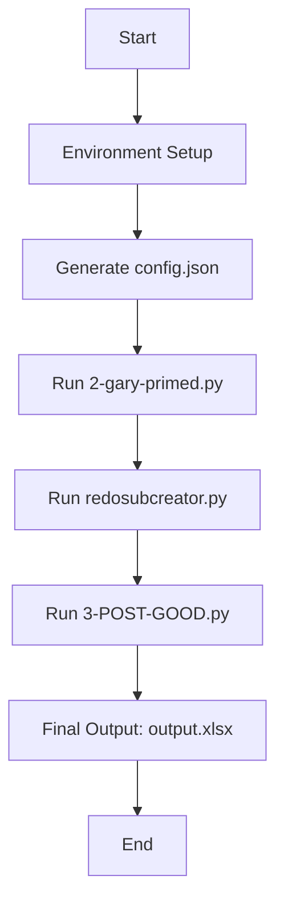

# Archival Workflow Automation

## Overview

This repository contains scripts and batch processes designed to automate large-scale archival workflows. The primary goal is to streamline the extraction, analysis, and enrichment of metadata from archival text files using Natural Language Processing (NLP) techniques and OpenAI's GPT models. This automation is crucial for efficiently managing extensive archival collections, ensuring consistent metadata quality, and enabling advanced data analysis.

## Table of Contents

- [Importance for Large-Scale Archival Workflows](#importance-for-large-scale-archival-workflows)
- [Workflow Overview](#workflow-overview)
- [Steps in the Process](#steps-in-the-process)
  - [1. Environment Setup](#1-environment-setup)
  - [2. Configuration](#2-configuration)
  - [3. Main Pipeline Execution](#3-main-pipeline-execution)
  - [4. Data Extraction and Initial Processing](#4-data-extraction-and-initial-processing)
  - [5. Subject and Creator Assignment](#5-subject-and-creator-assignment)
  - [6. Data Integration and Final Output Generation](#6-data-integration-and-final-output-generation)
- [Script Explanations](#script-explanations)
  - [`step-1-setup_and_run.bat`](#step-1-setup_and_runbat)
  - [`step-2-run-gary.bat`](#step-2-run-garybat)
  - [`3pipeline.py`](#3pipelinepy)
  - [`2-gary-primed.py`](#2-gary-primedpy)
  - [`redosubcreator.py`](#redosubcreatorpy)
  - [`3-POST-GOOD.py`](#3-post-goodpy)
  - [`requirements.txt`](#requirementstxt)
- [Getting Started](#getting-started)
  - [Prerequisites](#prerequisites)
  - [Installation](#installation)
  - [Configuration](#configuration)
  - [Execution](#execution)
- [Workflow Diagram](#workflow-diagram)
- [Additional Notes](#additional-notes)


## Importance for Large-Scale Archival Workflows

Large-scale archival projects often involve processing thousands of documents, which can be time-consuming and prone to human error if done manually. Automating these workflows:

- **Enhances Efficiency**: Significantly speeds up processing time.
- **Improves Consistency**: Ensures uniform metadata standards across the collection.
- **Enables Scalability**: Allows for handling larger datasets without a proportional increase in resources.
- **Facilitates Advanced Analysis**: Extracted metadata can be used for in-depth research and discovery.

## Workflow Overview

The workflow consists of the following key steps:

1. **Environment Setup**: Install necessary dependencies and set up a virtual environment.
2. **Configuration**: Generate a configuration file (`config.json`) with user-defined paths and API keys.
3. **Data Extraction and Initial Processing**: Process input text files to generate initial metadata.
4. **Subject and Creator Assignment**: Enrich metadata by assigning controlled vocabulary terms.
5. **Data Integration and Final Output Generation**: Merge and format the metadata for archival use.

## Steps in the Process

### 1. Environment Setup

**Script**: `step-1-setup_and_run.bat`

- Checks if Python is installed.
- Removes any existing virtual environment to ensure a clean setup.
- Creates and activates a new virtual environment.
- Upgrades `pip` to the latest version.
- Installs all required Python packages from `requirements.txt`.
- Downloads the `en_core_web_sm` language model for spaCy.
- Runs the main pipeline script (`3pipeline.py`).
- Deactivates the virtual environment after execution.

**Usage**:

Double-click the `step-1-setup_and_run.bat` file or run it from the command line:

```batch
step-1-setup_and_run.bat
```

### 2. Configuration

**Script**: `step-2-run-gary.bat`

- Prompts the user for:
  - Base directory where scripts are located.
  - Input directory containing `.txt` files.
  - Full paths to the main scripts.
- Collects the OpenAI API key securely from the user.
- Dynamically generates a `config.json` file based on user inputs.
- Runs the pipeline script (`3pipeline.py`).

**Usage**:

Run the script and follow the prompts:

```batch
step-2-run-gary.bat
```

### 3. Main Pipeline Execution

**Script**: `3pipeline.py`

- Loads configuration settings from `config.json`.
- Executes the scripts in sequence:
  1. `2-gary-primed.py`
  2. `redosubcreator.py`
  3. `3-POST-GOOD.py`
- Checks for successful completion of each step before proceeding.
- Handles errors and provides informative messages.

**Execution**:

This script is called automatically by the batch files but can be run directly:

```bash
python 3pipeline.py
```

### 4. Data Extraction and Initial Processing

**Script**: `2-gary-primed.py`

- Iterates over the `.txt` files in the input directory.
- Uses OpenAI's GPT model to generate titles and summaries.
- Extracts metadata such as creators, recipients, subjects, dates, named entities, states, tribes, policies, parties, and legal cases.
- Maps dates to congressional sessions.
- Saves the initial metadata to `testtranscript_info.xlsx`.

### 5. Subject and Creator Assignment

**Script**: `redosubcreator.py`

- Loads the initial metadata from `testtranscript_info.xlsx`.
- Uses OpenAI's GPT model to assign relevant creators and subjects based on controlled lists.
- Adds the assigned creators and subjects to the metadata.
- Saves the updated metadata to `updated_excel_file.xlsx`.

### 6. Data Integration and Final Output Generation

**Script**: `3-POST-GOOD.py`

- Loads the initial and updated metadata files.
- Merges assigned creators and subjects into the main DataFrame.
- Preprocesses and standardizes column values.
- Adds static metadata fields required for archival records.
- Reorders columns according to archival standards.
- Saves the final output to `output.xlsx`.

**Usage**:

This script requires three arguments and is called by `3pipeline.py`:

```bash
python 3-POST-GOOD.py <input_file> <updated_excel_file> <output_file>
```

## Script Explanations

### `step-1-setup_and_run.bat`

- **Purpose**: Automates environment setup and runs the pipeline.
- **Key Functions**:
  - Checks for Python installation.
  - Creates and activates a virtual environment.
  - Installs dependencies from `requirements.txt`.
  - Installs the spaCy language model.
  - Runs `3pipeline.py`.
  - Deactivates the virtual environment.

### `step-2-run-gary.bat`

- **Purpose**: Generates a configuration file and initiates the pipeline.
- **Key Functions**:
  - Prompts the user for necessary paths and API key.
  - Creates `config.json` based on user input.
  - Runs `3pipeline.py`.

### `3pipeline.py`

- **Purpose**: Manages the sequential execution of the main scripts.
- **Key Functions**:
  - Loads configuration settings.
  - Runs each script in order, checking for successful completion.
  - Provides error messages if a script fails.

### `2-gary-primed.py`

- **Purpose**: Extracts metadata from text files using NLP and OpenAI.
- **Key Functions**:
  - Generates titles and summaries for each text file.
  - Extracts and assigns metadata fields.
  - Categorizes legal cases.
  - Maps dates to congressional sessions.

### `redosubcreator.py`

- **Purpose**: Assigns creators and subjects using controlled vocabularies.
- **Key Functions**:
  - Loads existing metadata.
  - Uses OpenAI to match descriptions to controlled lists.
  - Updates the metadata with assigned creators and subjects.

### `3-POST-GOOD.py`

- **Purpose**: Finalizes the metadata for archival use.
- **Key Functions**:
  - Merges assigned creators and subjects into the main DataFrame.
  - Preprocesses data (e.g., date formatting, text standardization).
  - Adds static metadata fields.
  - Reorders and formats columns.
  - Outputs the final Excel file.

### `requirements.txt`

- **Purpose**: Lists all Python packages required for the scripts.
- **Notable Packages**:
  - `openai==0.27.8`: OpenAI API client compatible with the scripts.
  - `spacy==3.7.6`: For NLP tasks.
  - `en_core_web_sm`: spaCy's English language model.
  - `pandas`: Data manipulation.
  - `nltk`: Natural language processing.
  - `openpyxl`: Excel file handling.

## Getting Started

### Prerequisites

- **Python 3.6 or higher** installed on your system.
- **OpenAI API Key**: Obtain one from [OpenAI](https://platform.openai.com/).

### Installation

1. **Clone the Repository**:

   ```bash
   git clone https://github.com/yourusername/your-repo-name.git
   cd your-repo-name
   ```

2. **Run the Setup Script**:

   On Windows:

   ```batch
   step-1-setup_and_run.bat
   ```

   This script will handle the environment setup and initiate the pipeline.

### Configuration

- **Input Data**: Place your `.txt` files in the designated input directory.
- **API Key**: You will be prompted to enter your OpenAI API key during the configuration step. Ensure that your API key is kept secure and not hardcoded into any scripts.

### Execution

- Run `step-2-run-gary.bat` to configure and execute the pipeline.
- Follow the prompts provided during execution.

## Workflow Diagram



## Additional Notes

- **Error Handling**: Errors are logged to `errors.log` for troubleshooting.
- **Data Privacy**: Ensure compliance with data protection regulations when handling sensitive data.
- **Customization**:
  - **Controlled Vocabularies**: Controlled vocabularies and mappings can be customized within the scripts to suit specific archival needs.
  - **Static Metadata**: Static metadata fields in `3-POST-GOOD.py` can be adjusted as required.

---

Feel free to contribute to this project by submitting issues or pull requests. Your feedback and enhancements are welcome!
